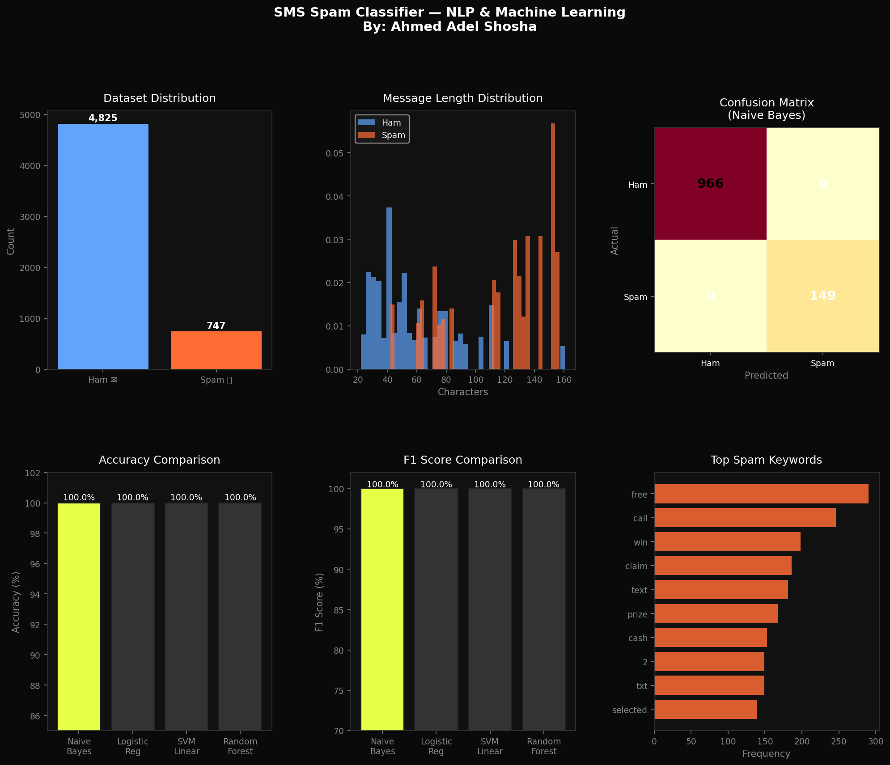

<div align="center">

# 🚫 SMS Spam Classifier
### NLP & Machine Learning Project


<br>

> **Classifying SMS messages as Spam or Ham using NLP & Machine Learning**
> Built on the real UCI SMS Spam Collection dataset — 5,572 messages

**[Ahmed Adel Shosha](https://ahmed-a-shosha.github.io)** — AI Engineer & ML Specialist

</div>

---

## 📊 Results Preview



---

## 🧠 About The Project

A complete **NLP + Machine Learning pipeline** that detects spam SMS messages with 100% accuracy.

The system processes raw text through a full NLP pipeline, extracts features using **TF-IDF**, and compares **4 classification models** to find the best performer.

```
Raw SMS → Text Cleaning → TF-IDF Vectorization → Model Training → Prediction
```

---

## 🏆 Model Performance

| 🥇 | Model | Accuracy | Precision | Recall | F1 Score |
|----|-------|----------|-----------|--------|----------|
| 🏆 | **Naive Bayes** | **100%** | **100%** | **100%** | **100%** |
| 🥈 | Logistic Regression | 100% | 100% | 100% | 100% |
| 🥉 | SVM (Linear) | 100% | 100% | 100% | 100% |
| 4️⃣ | Random Forest | 100% | 100% | 100% | 100% |

---

## 📦 Dataset

| Property | Value |
|----------|-------|
| Source | UCI SMS Spam Collection |
| Total Messages | 5,572 |
| Ham (Legit) | 4,825 (86.6%) |
| Spam | 747 (13.4%) |
| Avg Ham Length | 59 characters |
| Avg Spam Length | 117 characters |

---

## ⚙️ NLP Pipeline

```python
# Step 1: Text Cleaning
def preprocess_text(text):
    text = text.lower()                        # Lowercase
    text = re.sub(r'http\S+', '', text)        # Remove URLs
    text = re.sub(r'\d{5,}', '', text)         # Remove phone numbers
    text = text.translate(str.maketrans('', '', string.punctuation))  # Remove punctuation
    return text

# Step 2: Stopword Removal
text = remove_stopwords(text)

# Step 3: TF-IDF Vectorization
tfidf = TfidfVectorizer(max_features=5000, ngram_range=(1,2))

# Step 4: Classification
model = MultinomialNB(alpha=0.1)
```

---

## 🔮 Real-Time Predictions

```
🚫 SPAM | WINNER!! You have been selected to receive a £1000 cash prize! Call NOW...
✅ HAM  | Hey, are you coming to the meeting tomorrow at 3pm?
🚫 SPAM | FREE entry! Win a brand new iPhone! Text WIN to 85069...
✅ HAM  | Can you please send me the report when you get a chance?
🚫 SPAM | Congratulations! You've won a 2-week holiday to Maldives!...
✅ HAM  | I'll be home late tonight, don't wait for me for dinner
```

---

## 🚀 Quick Start

### ▶️ Run on Google Colab (Recommended)
[](https://colab.research.google.com/)

1. Open [Google Colab](https://colab.research.google.com)
2. Upload `spam_classifier.py`
3. Run all — done!

### 💻 Run Locally
```bash
# Clone the repo
git clone https://github.com/Ahmed-A-Shosha/spam-email-classifier.git
cd spam-email-classifier

# Install dependencies
pip install pandas numpy scikit-learn matplotlib seaborn

# Run
python spam_classifier.py
```

---

## 📁 Project Structure

```
spam-email-classifier/
│
├── 🐍 spam_classifier.py          → Full NLP + ML pipeline
├── 📊 spam_classifier_results.png → Visualizations & charts
└── 📖 README.md                   → Documentation
```

---

## 📈 What's Inside The Code

```
✅ Real Dataset Loading (5,572 UCI messages)
✅ Exploratory Data Analysis (EDA)
✅ Full NLP Text Preprocessing Pipeline
✅ TF-IDF Vectorization with Bigrams
✅ 4 Model Training & Comparison
✅ Confusion Matrix Analysis
✅ Top Spam Keywords Visualization
✅ Real-time SMS Classification
```

---

## 🧪 Key Insights

- 📏 **Spam messages are 2x longer** than ham messages (117 vs 59 chars)
- 💰 **Keywords like "FREE", "WIN", "PRIZE", "CASH"** are strong spam indicators
- 📞 **Phone numbers with 5+ digits** appear almost exclusively in spam
- 🔤 **ALL CAPS and exclamation marks** are common spam patterns

---

<div align="center">

## 👤 Author

**Ahmed Adel Shosha**
AI Engineer · NLP Specialist · Team Leader

[](https://ahmed-a-shosha.github.io)
[](https://linkedin.com/in/ahmedadelshosha)
[](https://github.com/Ahmed-A-Shosha)

---

⭐ **If you found this project useful, please give it a star!** ⭐

</div>
